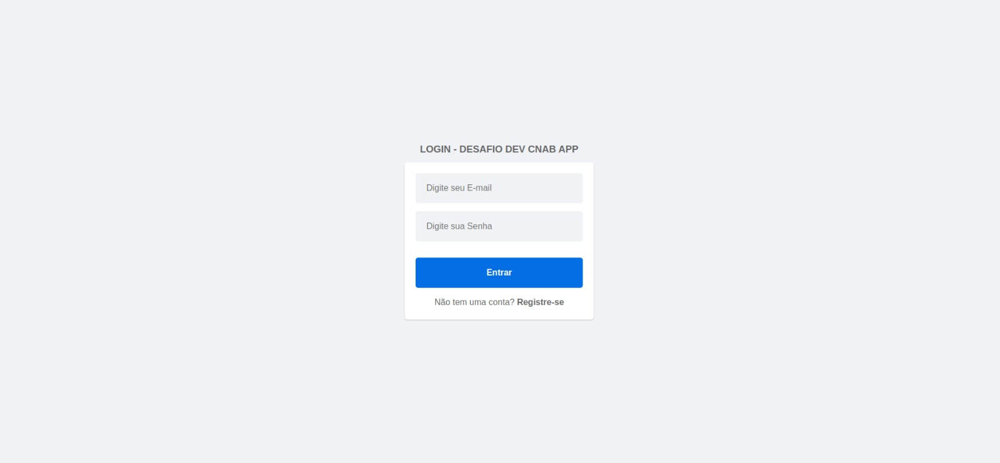
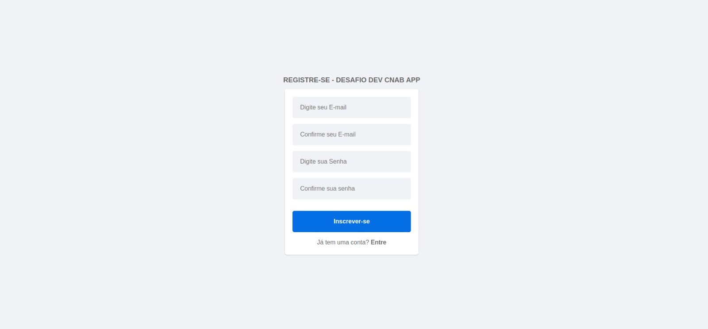
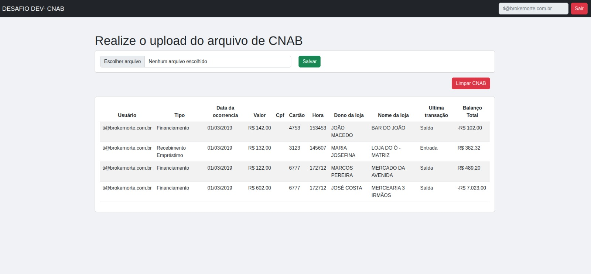

## INFORMAÇÃO/INSTALAÇÃO

Este projeto tem como finalidade de desenvolver mecanismo de acesso, dentre esses mecanismos estão em destaque:

* Senha segura.
* Expiração de sessão.
* Bloqueio por limite máximo de tentativas de login.
* proteção via captcha. 
* duplo fator de autenticação.

O objetivo é digitalizar a emissão e a baixa dos pagamentos, de forma que os dados sejam preenchidos automaticamente dentro de um padrão.

Tecnologias utilizadas:
* Ruby 3.2.1
* Rails 7.0.4.3 (api)
* React 18.2.0
* PostgreSQL Stable
* Docker/Compose 24.0.0

## Preparação de como configura este projeto ? 🔨
OBS: Para os requisitos nescessario para executa esse projeto é preciso do docker/docker-compose.  Dependendo da versão que está instalado em seu equipamento o comando de ação muda versões mais antigas 2022 estão operando com a sintaxe
```docker-compose ```a mais atual é ```docker compose ```. 

## Setup 
Na raiz do projeto acess_security_ror execute:
Para instala e configura as imagens e containers 
```shell
docker compose build
```
Levanta os servidores
```shell
docker compose up
```
Configurando o banco de dados
```shell
docker compose run --rm access_security_roo rails db:drop db:create db:migrate db:seed
```
Acesse [localhost:3000](localhost:3000) Para visualiza a ir a de login ou Realize um Cadastro usando esse link http://localhost:3000/signup

## Consumindo os endpoint da API (access_security_roo)
Nota: esta api se encontra preparada para versionamento. (plus)
### Rotas Auth

* POST http://localhost:3030/api/auth/sign_in (LOGIN)

* POST http://localhost:3030/api/v1/veiculos (CADASTRO DE USUÁRIO)

### Rotas users

* GET http://localhost:3030/api/myaccount/profile (PERFIL DO USUPARIO/SESSÃO)

* POST http://localhost:3030/api/myaccount/profile (ATUALIZA O DO USUARIO)(PLUS)

### Rotas CNAB

* POST http://localhost:3030/api/cnabs/import (IMPORTAÇÃO DO ARQUIVO CNAB)
* GET http://localhost:3030/api/cnabs (LISTA AS CNAB)
* DELETE http://localhost:3030/api/cnabs (DELETA TODAS AS CNAB DO USUÁRIO)

### Autenticação (plus)
* Após o login e necessário envia via headers o 
Authorization: Bearer <your_token>

#### login:
```POST localhost:3030/api/auth/sign_in```
```json
{
	"email": "test@gmail.com",
	"password": "12345678"
}
```
resposta:
```json
{
	"data": {
		"email": "test@test.com",
		"provider": "email",
		"uid": "test@test.com",
		"id": 2,
		"allow_password_change": false
	}
}
```
#### Cadastro:
```POST localhost:3030/api/auth```
```json
{
  "email": "test@gmail.com",
  "password": "12345678",
  "password_confirmation": "12345678"
}
```
resposta:
```json
{
	"status": "success",
	"data": {
		"id": 1,
		"provider": "email",
		"uid": "test@gmail.com",
		"allow_password_change": false,
		"email": "test@gmail.com",
		"created_at": "2023-05-22T10:48:54.580-04:00",
		"updated_at": "2023-05-22T10:48:54.639-04:00"
	}
}
```
### User
#### atualiza perfil (email, senha)
```PUT localhost:3030/api/myaccount/profile```
```json
{
  "email": "test@gmail.com",
  "password": "12345678",
  "password_confirmation": "12345678"
}
```
resposta:
```json
{
	"message": "Perfil atualizado."
}
```
#### consulta perfil/session
```GET localhost:3030/api/myaccount/profile```
```json
{
  "email": "test@gmail.com",
  "password": "12345678",
  "password_confirmation": "12345678"
}
```
resposta:
```json
{
	"data": {
		"id": 1,
		"provider": "email",
		"uid": "test@gmail.com",
		"allow_password_change": false,
		"email": "test@gmail.com",
		"created_at": "2023-05-22T10:48:54.580-04:00",
		"updated_at": "2023-05-22T10:49:16.968-04:00"
	}
}
```
### CNAB
#### lista:

```GET localhost:3030/api/cnabs```
```json
[
	{
		"id": 337,
		"type_cnabs": "Financiamento",
		"date_occurrence": "01/03/2019",
		"value": "142.0",
		"card": 4753,
		"hours": "153453",
		"deal": {
			"id": 3,
			"type_transaction": 3,
			"description": "Financiamento",
			"nature": "Saída",
			"signal": "-"
		},
		"user": {
			"id": 2,
			"provider": "email",
			"uid": "teste@test.com",
			"allow_password_change": false,
			"email": "teste@test.com",
			"created_at": "2023-05-22T11:08:40.547-04:00",
			"updated_at": "2023-05-23T00:37:27.506-04:00"
		},
		"store": {
			"id": 1,
			"store_owner": "JOÃO MACEDO",
			"cpf": "09620676017",
			"store_name": "BAR DO JOÃO",
			"balance_total": "-102.0"
		}
	},
	{
		"id": 338,
		"type_cnabs": "Recebimento Empréstimo",
		"date_occurrence": "01/03/2019",
		"value": "132.0",
		"card": 3123,
		"hours": "145607",
		"deal": {
			"id": 5,
			"type_transaction": 5,
			"description": "Recebimento Empréstimo",
			"nature": "Entrada",
			"signal": "+"
		},
		"user": {
			"id": 2,
			"provider": "email",
			"uid": "teste@test.com",
			"allow_password_change": false,
			"email": "teste@test.com",
			"created_at": "2023-05-22T11:08:40.547-04:00",
			"updated_at": "2023-05-23T00:37:27.506-04:00"
		},
		"store": {
			"id": 2,
			"store_owner": "MARIA JOSEFINA",
			"cpf": "55641815063",
			"store_name": "LOJA DO Ó - MATRIZ",
			"balance_total": "382.32"
		}
	},
	{
		"id": 339,
		"type_cnabs": "Financiamento",
		"date_occurrence": "01/03/2019",
		"value": "122.0",
		"card": 6777,
		"hours": "172712",
		"deal": {
			"id": 3,
			"type_transaction": 3,
			"description": "Financiamento",
			"nature": "Saída",
			"signal": "-"
		},
		"user": {
			"id": 2,
			"provider": "email",
			"uid": "teste@test.com",
			"allow_password_change": false,
			"email": "teste@test.com",
			"created_at": "2023-05-22T11:08:40.547-04:00",
			"updated_at": "2023-05-23T00:37:27.506-04:00"
		},
		"store": {
			"id": 3,
			"store_owner": "MARCOS PEREIRA",
			"cpf": "84515254073",
			"store_name": "MERCADO DA AVENIDA",
			"balance_total": "489.2"
		}
	},
	{
		"id": 344,
		"type_cnabs": "Financiamento",
		"date_occurrence": "01/03/2019",
		"value": "602.0",
		"card": 6777,
		"hours": "172712",
		"deal": {
			"id": 3,
			"type_transaction": 3,
			"description": "Financiamento",
			"nature": "Saída",
			"signal": "-"
		},
		"user": {
			"id": 2,
			"provider": "email",
			"uid": "teste@test.com",
			"allow_password_change": false,
			"email": "teste@test.com",
			"created_at": "2023-05-22T11:08:40.547-04:00",
			"updated_at": "2023-05-23T00:37:27.506-04:00"
		},
		"store": {
			"id": 4,
			"store_owner": "JOSÉ COSTA",
			"cpf": "23270298056",
			"store_name": "MERCEARIA 3 IRMÃOS",
			"balance_total": "-7023.0"
		}
	}
]
```

#### upload:
```POST localhost:3030/api/cnabs/import```
```json
{
  "file": "txt",
}
```
resposta:
```json
{
	"message": "CNAB importada com sucesso!",
	"status": true
}
```
#### deleta cnab do usuário logado:
```DELETE localhost:3030/api/cnabs```
```json
{
  "email": "test@gmail.com",
  "password": "12345678",
  "password_confirmation": "12345678"
}
```
resposta:
```json
{
	"message": "Removido com sucesso! 21 registros"
}
```
## Testes 

Configurando o banco de dados de teste

prepara a tabela Deal (transações)
```shell
docker compose run --rm access_security_roo rails ENVIROMENT=test db:seed
```
Executando todos os testes
```shell
docker compose run --rm access_security_roo rspec
```
## Telas
LOGIN

REGISTER

HOME

### Fim Obrigado! :D 🚀
